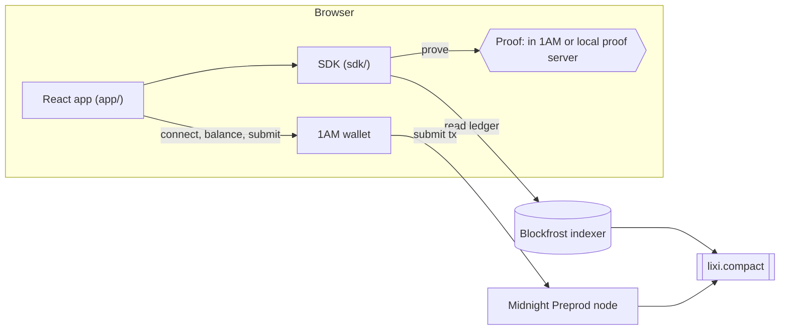

# Lixi: private red envelopes on Midnight

[](https://github.com/hms1499/lixi-midnight/actions/workflows/ci.yml)

Send lì xì (red envelopes) in tNIGHT as links. Each recipient opens one with a zero-knowledge proof: the link's secret never touches the chain, nobody watching the chain can tell which link paid an opening, and anyone can check that an envelope is fully funded without seeing how a personal envelope is split.

**[Try it](https://lixi-3nv.pages.dev)** · **[Slides](docs/slides/lixi-wave2.pdf)** · **[Contract on Preprod](deployments/preprod.json)** · Built for the [Midnight Buildathon](https://app.akindo.io/wave-hacks/jaMZjqPOBsLXvjdG), Wave 2.

## What it does

- **Seal.** A sender puts tNIGHT into an envelope of up to 16 lì xì, with lucky (random) or equal amounts, and picks when it expires.
- **Share.** Each lì xì is a link. Personal links go one per person; a group link lets each wallet open one.
- **Open.** A recipient opens the link, sees what is inside, connects 1AM and opens it. A proof shows they hold a valid lì xì without saying which one, and the tNIGHT lands in their wallet. The same link cannot pay twice.
- **Bring home.** After the expiry, the sender brings everything nobody opened back to the address that sealed it, in one transaction.

## Try it in 2 minutes

You need Chrome on a computer and the [1AM](https://1am.xyz) wallet extension, set to **Preprod**. 1AM pays the fees, so opening a lì xì needs no tNIGHT or DUST. To seal one, get tNIGHT from the [Preprod faucet](https://midnight-tmnight-preprod.nethermind.dev/).

1. Open **[the live site](https://lixi-3nv.pages.dev)** and choose **Fill an envelope**.
2. Connect 1AM, seal a small envelope, and copy a link.
3. Open the link in another browser profile with a second 1AM wallet, and open the lì xì.
4. Choose a 2-hour expiry to try **Bring home** the same day, from **My envelopes**.

On a phone the site shows the envelope and offers to copy the link for a computer.

## Test it in 10 minutes, no wallet

Prerequisites: Node 24 (`nvm use`) and the Compact toolchain with compiler 0.31.1.

```bash
curl --proto '=https' --tlsv1.2 -LsSf https://github.com/midnightntwrk/compact/releases/latest/download/compact-installer.sh | sh
export PATH="$HOME/.local/bin:$PATH"   # where the installer puts compact
compact update 0.31.1
npm ci
npm test   # compiles the contract, then runs every suite; contract, SDK and app tests use the real compiled contract
```

| Suite | Tests | What it covers |
|---|---:|---|
| `contract` | 32 | The Compact contract in the simulator: funding, Merkle paths, nullifiers, group limits, expiry, refund, forged Merkle paths and tampered shares |
| `sdk` | 44 | Seed derivation, splits, link encoding, Merkle trees, the sender vault, recovery, pre-checks |
| `cli` | 19 | Network config, sync progress, wallet cache, secret and output redaction (the chain scripts themselves run in the devnet suite) |
| `app` | 172 | Every page in jsdom against the compiled contract: create, share, claim, dashboard, refund, CSP |

CI runs all of them, plus the full compile with proving keys, on every push. A separate workflow runs the devnet end-to-end suite (deploy → concurrent claims from different wallets → sponsored claim → refund) against a local node; start it with the Docker command under [Develop](#develop), then run `npm run test:devnet -w @lixi/cli`.

## Architecture



| Package | What it holds |
|---|---|
| `contract/` | `lixi.compact`, generated bindings, Merkle helper, private-state witness, simulator tests |
| `sdk/` | Seed derivation, splits, claim links, sender vault, recovery, midnight-js wrappers, pre-checks |
| `cli/` | Headless wallet, Node providers, deploy/smoke/sponsor scripts, devnet end-to-end tests |
| `app/` | React app: create and share envelopes, claim links, dashboard with refund and backup |
| `deployments/` | Public deployment records (`preprod.json`) |

## How it uses Midnight

- **One Compact contract** holds every envelope: `createEnvelope`, `claim` and `refund`. Its ledger stores, per envelope, a Merkle root, the deposit, the expiry, the refund address, the group flag and whether it was refunded, plus a set of spent nullifiers, a set of address keys for group links, and the allowed expiry range.
- **Private state stays private.** The split lives in the sender's browser. A claim takes the share and its Merkle path as private witnesses; the circuit checks the path against the root, spends a one-time nullifier, and pays the share out. The chain never learns the secret or which link paid, and, for personal links with lucky amounts, how many lì xì there are and what the unopened ones hold.
- **Dual ledger.** The proof and the checks run over private data; the payout is an unshielded tNIGHT output to the recipient's address, so the transfer itself is public while the link stays secret.
- **Hashing is deliberate.** Envelope ids use `persistentHash`; leaves, nodes, nullifiers and address keys use `transientHash` (Poseidon) with domain tags, and off-chain code calls the compiled circuits instead of reimplementing them.
- **Proving.** Proofs are made in 1AM by default (where 1AM proves is not yet verified; see Limitations), or by a proof server on your own machine (choose "On this computer" under Advanced). Lixi itself never sends a proof to a shared server.
- **No admin key.** Every deployment gives up its maintenance authority, so nobody can change the contract.

## Privacy model

| The chain sees | It never sees |
|---|---|
| that an envelope exists, its total and its expiry | with lucky amounts, how many lì xì a personal envelope holds |
| whether it uses a group link | with lucky amounts, the sizes of the lì xì nobody has opened |
| the sender's address | which link paid which opening |
| each opening: who received, and how much | the secrets inside the links |

A link works like cash: whoever opens it first gets that lì xì. Its secret lives only in the URL fragment, which browsers never send to a server.

## Security notes

- The design and its audit (findings and fixes) are in [the design spec](docs/superpowers/specs/2026-09-30-lixi-design.md), §6.
- The built page ships a strict Content-Security-Policy: it may only talk to its own origin, the Blockfrost indexer and a proof server on `127.0.0.1`.
- The sender's backup string re-derives every envelope; the app presents it like a private key.

## Limitations

- **Preprod only.** tNIGHT has no value.
- **1AM on desktop Chrome only.** Lace was dropped on 2026-10-07 after its connect hung and its DUST balance froze on Preprod ([lace#2256](https://github.com/input-output-hk/lace/issues/2256)).
- **Where 1AM proves is unverified.** If it proves on its own servers, those servers see the claim secret; choose the local proof server to avoid that.
- **The Blockfrost project id ships in the page**, as any browser-side Blockfrost id does.
- **Payouts are unshielded**, so each opening is public.
- **Group links:** one person with many wallets can open several lì xì, and because a group splits equally, the first opening reveals how many there are.
- **Equal amounts:** the total is public, so once one lì xì of an equal split is opened, anyone can work out how many there are and what the rest hold. Lucky amounts keep both hidden. The receipt after opening says only what holds for that envelope.

## Roadmap (Wave 3)

- Open lì xì from the 1AM mobile app.
- A fee sponsor for any wallet, so recipients with no DUST can claim.
- Shielded payouts.
- Larger envelopes than 16 lì xì.
- QR codes for giving lì xì in person.

## Develop

Run the app locally (it needs `VITE_BLOCKFROST_PROJECT_ID` in `app/.env.local`, see below):

```bash
npm run build -w @lixi/app && npm run preview -w @lixi/app   # http://localhost:4173, with the production CSP
npm run dev -w @lixi/app                                     # dev server with hot reload (no CSP)
```

To prove on your own machine instead of in 1AM, start the proof server and choose "On this computer" under Advanced:

```bash
docker run -p 127.0.0.1:6300:6300 midnightntwrk/proof-server:8.1.0 midnight-proof-server
```

Chain work needs Docker:

```bash
docker compose -f devnet/compose.yml up -d --wait   # local node, indexer, proof server
npm run test:devnet -w @lixi/cli                    # deploy → claims → sponsored claim → refund (~7 min)
npm run deploy -w @lixi/cli                         # deploy to the devnet; --network preprod needs cli/.env (below)
```

Preprod goes through [Blockfrost](https://blockfrost.io), because Midnight is shutting down its own Preprod indexer and RPC. Create a free Blockfrost project for the **Midnight Preprod** network and copy its project id. Then:

- **Chain scripts** (`deploy`, `smoke`, `sponsor` with `-- --network preprod`): put `BLOCKFROST_PROJECT_ID=<id>` in `cli/.env`, next to the deployer secret (`LIXI_DEPLOYER_MNEMONIC` or `LIXI_DEPLOYER_SEED`). The first run syncs the wallet from genesis (~35–70 min).
- **The app**: put `VITE_BLOCKFROST_PROJECT_ID=<id>` in `app/.env.local`. Without it, `dev`, `build` and `preview` stop with a message naming that variable. The id ends up in the built page, so use a separate project for the app.

Both files are gitignored. The live site is a static build uploaded to Cloudflare Pages with `npx wrangler pages deploy app/dist --project-name lixi`; its headers come from `app/public/_headers`.

## License

Apache-2.0. Fonts: Fraunces and Playwrite VN (SIL Open Font License 1.1). Icons adapted from Lucide (ISC).
