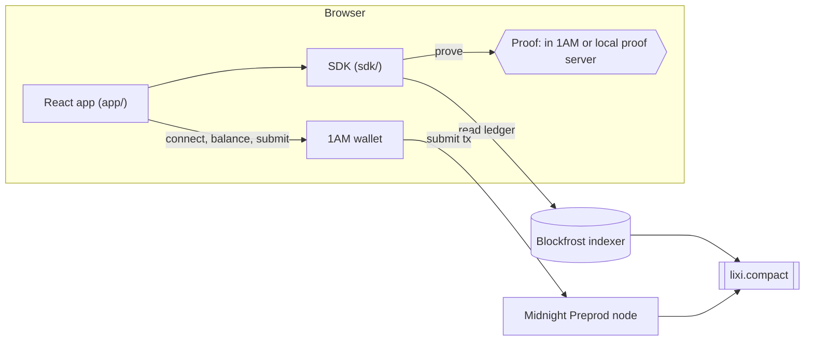

# Lixi Wave 2 Submission Implementation Plan

> **For agentic workers:** REQUIRED SUB-SKILL: Use superpowers:subagent-driven-development (recommended) or superpowers:executing-plans to implement this plan task-by-task. Steps use checkbox (`- [ ]`) syntax for tracking.

**Goal:** Ship everything the AKINDO Wave 2 rules require: a live site on Cloudflare Pages, a judge-ready README, a slide deck on claude.ai, and ready-to-paste submission text with a gate checklist.

**Architecture:**
- **No new app features.** The only code change replaces `app/vercel.json` with a Cloudflare `_headers` file, guarded by the existing config test.
- **The site.** It is built locally and uploaded with `wrangler`.
- **The documents.** The README and the submission text are Markdown in the repo. The deck is a claude.ai Slides artifact.

**Tech Stack:** Vite 8 static build, Cloudflare Pages (free), `wrangler` CLI (run through `npx`, not added as a dependency), claude.ai Slides artifact type, GitHub-flavoured Markdown with Mermaid.

**Spec:** `docs/superpowers/specs/2026-10-07-lixi-wave2-submission-design.md`

## Global Constraints

- **Environment.** Node 24: run `source ~/.nvm/nvm.sh && nvm use 24` in every new shell. Run every command from the repo root unless a step says otherwise.
- **Branch and commits.** Work on `feat/wave2-submission`, which holds the spec commits `a4d7f4c` and `6b2117e`. Use conventional commits, each ending with `Co-Authored-By: Claude Opus 5.5 <noreply@anthropic.com>`.
- **The CSP** must be defined in exactly two places afterwards: `app/src/csp.ts` (the meta tag) and `app/public/_headers` (the header). `app/test/config.test.ts` keeps them equal.
- **The Blockfrost id.**
  - Never print or log the project id or an endpoint URL that carries it.
  - The public build uses a **separate** Blockfrost project, created by the user and set as `VITE_BLOCKFROST_PROJECT_ID` in gitignored `app/.env.local`.
- **Deploys.** Every `wrangler pages deploy` publishes the site, so ask the user before each one. Never connect the Pages project to Git; Cloudflare's builders have no Compact compiler.
- **Copy.** Everything judges read is in English. App copy names 1AM only; the README mentions Lace only where it says why Lace was dropped.
- **Video.**
  - The README has **no** video link.
  - The deck and the submission text carry a video placeholder, which the user fills in.
  - Nothing in this plan records or scripts video.
- **Deadline.** Wave 2 closes on 2026-10-17. The user submits on AKINDO personally.
- **Merging (user's rule).** Once the local gate passes (`npm run format:check && npm run lint && npm run typecheck && npm test && npm run build -w @lixi/app`):
  1. fast-forward `main`;
  2. push it;
  3. delete the branch.

  Do not wait for CI.

## Review Focus

1. **Cloudflare serves the ledger `.wasm` with a wrong MIME type.** The page then hangs on "Lighting the lanterns…". Expected: `content-type: application/wasm`, and the app renders. Task 2 pins this.
2. **A judge opens a deep link (`/dashboard`, `/create`, `/c#…`) directly.** Expected: HTTP 200 and the page, never a 404. Task 2 pins this.
3. **The public Blockfrost project id is wrong or out of quota.** Every read then fails. Expected: a live claim link shows "… tNIGHT is sealed inside" before connecting. Task 2 pins this.
4. **A judge follows the README on a clean clone, and it fails.** Possible causes: a missing step, an override, a stale count. Expected: a fresh clone runs `npm ci && npm test` green in under 10 minutes, with the counts the README states. Task 3 pins this.
5. **The slides link asks judges to log in.** Expected: it opens in a logged-out private window. Task 4 pins this.

---

### Task 1: Replace `vercel.json` with a Cloudflare `_headers` file

**Files:**
- Create: `app/public/_headers`
- Delete: `app/vercel.json`
- Modify:
  - `app/test/config.test.ts` (the second `describe('CSP')` test)
  - `.gitignore` (`.vercel/` becomes `.wrangler/`)
  - `CLAUDE.md` (the CSP invariant line)
  - `docs/superpowers/specs/2026-09-30-lixi-design.md` (the T14 row)

**Interfaces:**
- Produces: `app/public/_headers`, which Vite copies to `app/dist/_headers`. Task 2 deploys it.

- [ ] **Step 1: Write the failing test**

In `app/test/config.test.ts`:
- add `existsSync` to the `node:fs` import, so it reads `import { existsSync, readFileSync } from 'node:fs';`;
- replace the test `'is the same policy the Vercel deployment sends as a header, plus frame-ancestors'` with:

```ts
  it('is the same policy Cloudflare Pages sends as a header for every path, plus frame-ancestors', () => {
    const headers = readFileSync(new URL('../public/_headers', import.meta.url), 'utf8').split('\n');
    expect(headers[0]).toBe('/*');
    const value = (name: string) =>
      headers.find((line) => line.startsWith(`  ${name}: `))?.slice(`  ${name}: `.length);
    expect(value('Content-Security-Policy')).toBe(`${cspFor('preprod')}; frame-ancestors 'none'`);
    expect(value('Referrer-Policy')).toBe('no-referrer');
    expect(value('X-Content-Type-Options')).toBe('nosniff');
    expect(existsSync(new URL('../vercel.json', import.meta.url))).toBe(false);
  });
```

- [ ] **Step 2: Run it to verify it fails**

Run: `npm test -w @lixi/app -- test/config.test.ts`

Expected: FAIL with `ENOENT … public/_headers`.

- [ ] **Step 3: Implement**

Create `app/public/_headers`. Its first line is `/*`, and each header line is indented with exactly two spaces:

```
/*
  Content-Security-Policy: default-src 'self'; script-src 'self' 'wasm-unsafe-eval'; style-src 'self'; img-src 'self' data:; connect-src 'self' https://midnight-preprod.blockfrost.io wss://midnight-preprod.blockfrost.io http://127.0.0.1:6300; object-src 'none'; base-uri 'none'; form-action 'none'; frame-ancestors 'none'
  Referrer-Policy: no-referrer
  X-Content-Type-Options: nosniff
```

Then:
- run `git rm app/vercel.json`;
- in `.gitignore`, replace the line `.vercel/` with `.wrangler/`;
- in `CLAUDE.md`, replace the line

  `- The CSP is defined twice: `app/src/csp.ts` (meta tag in the built page) and `app/vercel.json` (header). `app/test/config.test.ts` keeps them equal; a new host the page talks to goes into both.`

  with

  `- The CSP is defined twice: `app/src/csp.ts` (meta tag in the built page) and `app/public/_headers` (header on Cloudflare Pages). `app/test/config.test.ts` keeps them equal; a new host the page talks to goes into both.`
- in `docs/superpowers/specs/2026-09-30-lixi-design.md`, replace the row `| T14 | Vercel deploy (after confirmation) | T8–T10 | Should | Claude | E |` with `| T14 | Cloudflare Pages deploy (after confirmation; was Vercel, changed 2026-10-07) | T8–T10 | Should | Claude | E |`.

- [ ] **Step 4: Run the tests, then the build, and check the file reaches `dist/`**

Run:

```bash
npm test -w @lixi/app -- test/config.test.ts && npm run build -w @lixi/app > /dev/null && diff app/public/_headers app/dist/_headers && echo COPIED
```

Expected: PASS, then `COPIED`.

- [ ] **Step 5: Commit**

```bash
git add app/public/_headers app/test/config.test.ts .gitignore CLAUDE.md docs/superpowers/specs/2026-09-30-lixi-design.md
git commit -m "build(app): Cloudflare Pages _headers replaces vercel.json; the config test keeps the CSP equal

Co-Authored-By: Claude Opus 5.5 <noreply@anthropic.com>"
```

---

### Task 2: Deploy to Cloudflare Pages and check the live site

**Files:** none in the repo. The live URL is recorded in the ledger as `LIVE_URL=https://….pages.dev`; Tasks 3–5 read it from there.

**Interfaces:**
- Consumes: `app/public/_headers` (Task 1).
- Produces: `LIVE_URL`, the production URL that `wrangler` prints.

- [ ] **Step 1: The user sets up the public Blockfrost project and Cloudflare login**

Ask the user to do three things, then wait until they confirm:
1. In Blockfrost, create a **new** project for **Midnight Preprod**, named for example `lixi-public-site`.
2. Put its id in `app/.env.local` as `VITE_BLOCKFROST_PROJECT_ID=<new id>`, replacing the old line. Do not paste the id into chat.
3. Run `! npx wrangler login` and approve in the browser.

Then check, without printing the id:

```bash
npx wrangler whoami | grep -iE "logged in|account" | head -3
grep -cE '^VITE_BLOCKFROST_PROJECT_ID=.+' app/.env.local
```

Expected: a "logged in" line, then `1`.

- [ ] **Step 2: Build with the public project id**

Run: `npm run build -w @lixi/app 2>&1 | tail -3 && ls app/dist/_headers app/dist/index.html`

Expected: the build ends with `✓ built`, and both files are listed.

- [ ] **Step 3: Deploy, after asking**

Ask: "Deploy app/dist to Cloudflare Pages as project `lixi`?" On yes, run:

```bash
npx wrangler pages project create lixi --production-branch main 2>&1 | tail -2 || true
npx wrangler pages deploy app/dist --project-name lixi --branch main --commit-dirty=true 2>&1 | tail -5
```

Expected: `✨ Deployment complete!` with a URL. The production URL is `https://lixi.pages.dev`, or `https://lixi-<suffix>.pages.dev` if that name is taken. Append `LIVE_URL=<production URL>` to the ledger.

- [ ] **Step 4: Check the headers, MIME types and deep links (Review Focus 1–2)**

Run, with `LIVE` set to the production URL:

```bash
LIVE=https://lixi.pages.dev   # use the URL from Step 3
curl -sI "$LIVE/" | grep -iE "^(HTTP|content-security-policy|referrer-policy|x-content-type-options)"
for p in /create /dashboard /c; do printf "%s " "$p"; curl -s -o /dev/null -w "%{http_code}\n" "$LIVE$p"; done
WASM=$(ls app/dist/assets/*.wasm | head -1 | xargs basename)
curl -sI "$LIVE/assets/$WASM" | grep -iE "^(HTTP|content-type)"
curl -sI "$LIVE/keys/claim.prover" | grep -iE "^(HTTP|content-length)"
```

Expected:
- `HTTP/2 200`, then the CSP header equal to `app/public/_headers`, then `referrer-policy: no-referrer` and `x-content-type-options: nosniff`;
- `/create 200`, `/dashboard 200` and `/c 200`;
- the wasm returns `200` with `content-type: application/wasm`;
- `claim.prover` returns `200` with a non-zero length.

- [ ] **Step 5: Check the live pages in a browser (Review Focus 3)**

With Playwright at 1280×800:
1. Open `$LIVE/`. Wait until `main` exists, which means past "Lighting the lanterns…". Read the console: it must show no `Content-Security-Policy` message.
2. Open `$LIVE/create`. Expect the form and "No 1AM wallet found in this browser."
3. Open a real claim link on `$LIVE/c#…`. Ask the user for one: they seal a 1 tNIGHT, 1-link envelope on the live site, or reuse an unexpired link. Expect "… tNIGHT is sealed inside", which proves the public Blockfrost project reads the chain.
4. In a new context with an iPhone user agent at 375×812, open `$LIVE/create`. Expect "Open this on a computer."
5. Delete any `.playwright-mcp/` files the run created.

- [ ] **Step 6: The user opens a lì xì on the live site**

Ask the user to open the link from Step 5.3 with 1AM on the live site, and to report the result. Expected: "It is in your wallet", with a **View transaction** link. Note the result in the ledger.

If anything in Steps 4–6 fails, follow superpowers:systematic-debugging. A fix is a code change, which gets its own failing test and commit before a redeploy (ask again before redeploying).

---

### Task 3: Rewrite the README for judges

**Files:**
- Modify: `README.md` (whole file)

**Interfaces:**
- Consumes: `LIVE_URL` (Task 2).
- Produces: a README with the literal token `SLIDES_URL` in two places. Task 4 replaces both with the deck's share link.

- [ ] **Step 1: Re-measure the test counts on a fresh clone (Review Focus 4)**

Run:

```bash
SCRATCH=<the session scratchpad directory>/fresh-clone && rm -rf "$SCRATCH" && mkdir -p "$SCRATCH"
git clone -q . "$SCRATCH/lixi" && cd "$SCRATCH/lixi"
time (npm ci > ../ci.log 2>&1 && npm test > ../test.log 2>&1); echo "exit $?"
grep -E "Test Files|Tests " ../test.log
cd - > /dev/null
```

Expected: `exit 0`, a total time under 10 minutes, and four `Tests` lines. Use **those** counts in Step 2. At the time of writing they were contract 32, sdk 44, cli 19 and app 114; replace them if they differ. If `npm ci` or `npm test` fails on the clone, the README needs the missing step: find it, write it into Step 2, and record what it was.

- [ ] **Step 2: Write the README**

Replace `README.md` with the text below:
- replace `LIVE_URL` with the URL from Task 2;
- update the counts if Step 1 measured different ones;
- leave `SLIDES_URL` as is (Task 4 fills it in).

````markdown
# Lixi: private red envelopes on Midnight

[](https://github.com/hms1499/lixi-midnight/actions/workflows/ci.yml)

Send lì xì (red envelopes) in tNIGHT as links. Each recipient opens one with a zero-knowledge proof: the link's secret never touches the chain, nobody can tell who received which lì xì, and anyone can check that an envelope is fully funded without seeing how it is split.

**[Try it](LIVE_URL)** · **[Slides](SLIDES_URL)** · **[Contract on Preprod](deployments/preprod.json)** · Built for the [Midnight Buildathon](https://app.akindo.io/wave-hacks/jaMZjqPOBsLXvjdG), Wave 2.

## What it does

- **Seal.** A sender puts tNIGHT into an envelope of up to 16 lì xì, with lucky (random) or equal amounts, and picks when it expires.
- **Share.** Each lì xì is a link. Personal links go one per person; a group link lets each wallet open one.
- **Open.** A recipient opens the link, sees what is inside, connects 1AM and opens it. A proof shows they hold a valid lì xì without saying which one, and the tNIGHT lands in their wallet. The same link cannot pay twice.
- **Bring home.** After the expiry, the sender brings everything nobody opened back to the address that sealed it, in one transaction.

## Try it in 2 minutes

You need Chrome on a computer and the [1AM](https://1am.xyz) wallet extension, set to **Preprod**. 1AM pays the fees, so opening a lì xì needs no tNIGHT or DUST. To seal one, get tNIGHT from the [Preprod faucet](https://midnight-tmnight-preprod.nethermind.dev/).

1. Open **[the live site](LIVE_URL)** and choose **Fill an envelope**.
2. Connect 1AM, seal a small envelope, and copy a link.
3. Open the link in another browser profile with a second 1AM wallet, and open the lì xì.
4. Choose a 2-hour expiry to try **Bring home** the same day, from **My envelopes**.

On a phone the site shows the envelope and offers to copy the link for a computer.

## Test it in 10 minutes, no wallet

Prerequisites: Node 24 (`nvm use`) and the Compact toolchain with compiler 0.31.1.

```bash
curl --proto '=https' --tlsv1.2 -LsSf https://github.com/midnightntwrk/compact/releases/latest/download/compact-installer.sh | sh
compact update 0.31.1
npm ci
npm test   # compiles the contract, then runs every suite against the real compiled contract
```

| Suite | Tests | What it covers |
|---|---:|---|
| `contract` | 32 | The Compact contract in the simulator: funding, Merkle paths, nullifiers, group limits, expiry, refund, forged proofs |
| `sdk` | 44 | Seed derivation, splits, link encoding, Merkle trees, the sender vault, recovery, pre-checks |
| `cli` | 19 | Deploy, smoke and sponsor scripts, wallet cache, secret and output redaction |
| `app` | 114 | Every page in jsdom against the compiled contract: create, share, claim, dashboard, refund, CSP |

CI runs all of them, plus the full compile with proving keys, on every push. A separate workflow runs a devnet end-to-end test (deploy → concurrent claims → refund) with Docker: `npm run test:devnet -w @lixi/cli`.

## Architecture



| Package | What it holds |
|---|---|
| `contract/` | `lixi.compact`, generated bindings, Merkle helper, private-state witness, simulator tests |
| `sdk/` | Seed derivation, splits, claim links, sender vault, recovery, midnight-js wrappers, pre-checks |
| `cli/` | Headless wallet, Node providers, deploy/smoke/sponsor scripts, devnet end-to-end tests |
| `app/` | React app: create and share envelopes, claim links, dashboard with refund and backup |
| `deployments/` | Public deployment records (`preprod.json`) |

## How it uses Midnight

- **One Compact contract** holds every envelope: `createEnvelope`, `claim` and `refund`. Its ledger stores, per envelope, only a Merkle root, the deposit, the expiry, the refund address and the group flag, plus a set of spent nullifiers and, for group links, a set of address keys.
- **Private state stays private.** The split lives in the sender's browser. A claim takes the share and its Merkle path as private witnesses; the circuit checks the path against the root, spends a one-time nullifier, and pays the share out. The chain never learns the secret, the number of lì xì or the other amounts.
- **Dual ledger.** The proof and the checks run over private data; the payout is an unshielded tNIGHT output to the recipient's address, so the transfer itself is public while the link stays secret.
- **Hashing is deliberate.** Envelope ids use `persistentHash`; leaves, nodes, nullifiers and address keys use `transientHash` (Poseidon) with domain tags, and off-chain code calls the compiled circuits instead of reimplementing them.
- **Proving never goes to a shared server.** Proofs are made in 1AM, or by a proof server on your own machine (choose "On this computer" under Advanced).
- **No admin key.** Every deployment gives up its maintenance authority, so nobody can change the contract.

## Privacy model

| The chain sees | It never sees |
|---|---|
| that an envelope exists, its total and its expiry | how many lì xì there are, or the size of each |
| whether it uses a group link | who the links went to |
| the sender's address | the secrets inside the links |
| each opening: who received, and how much | which lì xì are still unopened |

A link works like cash: whoever opens it first gets that lì xì. Its secret lives only in the URL fragment, which browsers never send to a server.

## Security notes

- The design and its audit (findings and fixes) are in [the design spec](docs/superpowers/specs/2026-09-30-lixi-design.md), §6.
- The built page ships a strict Content-Security-Policy: it may only talk to its own origin, the Blockfrost indexer and a proof server on `127.0.0.1`.
- The sender's backup string re-derives every envelope; the app presents it like a private key.

## Limitations

- **Preprod only.** tNIGHT has no value.
- **1AM on desktop Chrome only.** Lace was dropped on 2026-10-07 after its connect hung and its DUST balance froze on Preprod ([lace#2256](https://github.com/input-output-hk/lace/issues/2256)).
- **Where 1AM proves is unverified.** If it proves on its own servers, those servers see the claim secret; choose the local proof server to avoid that.
- **The Blockfrost project id ships in the page**, as any browser-side Blockfrost id does.
- **Payouts are unshielded**, so each opening is public.
- **Group links:** one person with many wallets can open several lì xì.

## Roadmap (Wave 3)

- Open lì xì from the 1AM mobile app.
- A fee sponsor for any wallet, so recipients with no DUST can claim.
- Shielded payouts.
- Larger envelopes than 16 lì xì.
- QR codes for giving lì xì in person.

## Develop

Run the app locally (it needs `VITE_BLOCKFROST_PROJECT_ID` in `app/.env.local`, see below):

```bash
npm run build -w @lixi/app && npm run preview -w @lixi/app   # http://localhost:4173, with the production CSP
npm run dev -w @lixi/app                                     # dev server with hot reload (no CSP)
```

To prove on your own machine instead of in 1AM, start the proof server and choose "On this computer" under Advanced:

```bash
docker run -p 127.0.0.1:6300:6300 midnightntwrk/proof-server:8.1.0 midnight-proof-server
```

Chain work needs Docker:

```bash
docker compose -f devnet/compose.yml up -d --wait   # local node, indexer, proof server
npm run test:devnet -w @lixi/cli                    # deploy → claims → sponsored claim → refund (~7 min)
npm run deploy -w @lixi/cli                         # deploy to the devnet; --network preprod needs cli/.env (below)
```

Preprod goes through [Blockfrost](https://blockfrost.io), because Midnight is shutting down its own Preprod indexer and RPC. Create a free Blockfrost project for the **Midnight Preprod** network and copy its project id. Then:

- **Chain scripts** (`deploy`, `smoke`, `sponsor` with `-- --network preprod`): put `BLOCKFROST_PROJECT_ID=<id>` in `cli/.env`, next to the deployer secret (`LIXI_DEPLOYER_MNEMONIC` or `LIXI_DEPLOYER_SEED`). The first run syncs the wallet from genesis (~35–70 min).
- **The app**: put `VITE_BLOCKFROST_PROJECT_ID=<id>` in `app/.env.local`. Without it, `dev`, `build` and `preview` stop with a message naming that variable. The id ends up in the built page, so use a separate project for the app.

Both files are gitignored. The live site is a static build uploaded to Cloudflare Pages with `npx wrangler pages deploy app/dist --project-name lixi`; its headers come from `app/public/_headers`.

## License

Apache-2.0. Fonts: Fraunces and Playwrite VN (SIL Open Font License 1.1). Icons adapted from Lucide (ISC).
````

- [ ] **Step 3: Check the README**

Run:

```bash
npx prettier --check README.md
grep -c "SLIDES_URL" README.md
grep -ciE "lace\.io|vercel|video" README.md
grep -o "LIVE_URL" README.md | wc -l
```

Expected:
- Prettier passes. If not, run `npx prettier --write README.md` and re-read the tables;
- `2` (both slides tokens left for Task 4);
- `0` for the third check;
- `0` for the fourth (every `LIVE_URL` replaced).

Also check every relative link:

```bash
for f in deployments/preprod.json docs/superpowers/specs/2026-09-30-lixi-design.md; do test -f "$f" && echo "ok $f"; done
```

Expected: two `ok` lines.

- [ ] **Step 4: Commit**

```bash
git add README.md
git commit -m "docs: README for judges: try it, test it in 10 minutes, architecture, Midnight integration, privacy, limits

Co-Authored-By: Claude Opus 5.5 <noreply@anthropic.com>"
```

---

### Task 4: The slide deck on claude.ai

**Files:**
- Modify: `README.md` (replace both `SLIDES_URL`)
- Create: screenshots for the deck in the scratchpad directory (not in the repo)

**Interfaces:**
- Consumes: `LIVE_URL` (Task 2), and README counts and wording (Task 3).
- Produces: `SLIDES_URL`, the deck's claude.ai link, appended to the ledger.

- [ ] **Step 1: Start from the Slides type**

Call the Artifact tool with `action: "quickstart"` and `intent: "slides"`. Follow what it returns:
- create the deck from the Slides `type_url` it names, with `title: "Lixi: private red envelopes on Midnight"`;
- read the instructions the result carries before writing any content.

- [ ] **Step 2: Take screenshots of the live app**

With Playwright, take PNGs into the scratchpad directory:
- the home hero (1280×800);
- the create form with its lights;
- a claim link before connecting ("… tNIGHT is sealed inside");
- **My envelopes** with lights;
- the phone view (375×812) with "Open this on a computer.".

Use the live site from Task 2, and the user's test envelopes, where they exist.

- [ ] **Step 3: Write the 11 slides**

Fill the deck with this content, using the type's own data files or store as its instructions say:

| # | Title | Content |
|---|---|---|
| 1 | Lixi | "Private red envelopes on Midnight." The live URL and the repo URL. |
| 2 | Red packets are public | On-chain red packets (Mask HappyRedPacket on EVM and Solana, BSC, IRISnet) show every amount, every recipient and the split. |
| 3 | Every light is one lì xì | Each lì xì is a link; only its link knows whose. The sender sees lights, not names. |
| 4 | Seal → share → open → bring home | The four screenshots from Step 2, one line each. |
| 5 | How a claim stays private | A Merkle root of the shares on chain; the claim proves a valid leaf and spends a nullifier; the secret stays in the URL fragment. |
| 6 | What the chain sees | The two-column privacy table from the README. |
| 7 | Built on Midnight | One Compact contract (`createEnvelope`, `claim`, `refund`); private witnesses with unshielded payouts (dual ledger); proving in 1AM or locally; maintenance authority given up. |
| 8 | Tested end to end | The four suites with the counts from Task 3, CI on every push, a devnet E2E, and an audit with its fixes. |
| 9 | Who it is for | Tết lucky money, weddings, birthdays, team bonuses, community giveaways. No red-envelope entry among ~161 Wave 1 submissions. |
| 10 | Wave 3 | The README roadmap's five items. |
| 11 | Links | The live site, the repo, the contract, and "Video: (link added by the team)". |

The look is the app's own: a night background, lantern red, seal gold, Fraunces for titles. Use the default design system the quickstart offers only if it can carry that palette. Otherwise style the deck directly.

- [ ] **Step 4: Make the link public, then check it (Review Focus 5)**

1. Append `SLIDES_URL=<artifact URL>` to the ledger.
2. Ask the user to open the deck on claude.ai and set its sharing so **anyone with the link can view**, then to confirm. A new artifact is private.
3. Open the link in a logged-out Playwright context. Expected: the deck renders, with no login page.

- [ ] **Step 5: Put the link in the README and commit**

Run:

```bash
sed -i '' "s#SLIDES_URL#<artifact URL>#g" README.md && grep -c "SLIDES_URL" README.md
```

Expected: `0`. Then:

```bash
git add README.md
git commit -m "docs: link the slide deck from the README

Co-Authored-By: Claude Opus 5.5 <noreply@anthropic.com>"
```

---

### Task 5: Submission text, gate checklist, final gate and merge

**Files:**
- Create: `docs/submission/wave-2.md`

**Interfaces:**
- Consumes: `LIVE_URL` (Task 2) and `SLIDES_URL` (Task 4).

- [ ] **Step 1: Write the submission text**

Create `docs/submission/wave-2.md`, with `LIVE_URL` and `SLIDES_URL` replaced by the real links:

````markdown
# AKINDO Wave 2 submission: ready to paste

Paste each block into the matching field on the AKINDO submission page. Fill in the video link, then tick the gate checklist before submitting (deadline 2026-10-17).

## Project name

Lixi

## Tagline

Private red envelopes (lì xì) on Midnight: every link is one lì xì, and only its link knows whose.

## Description

On-chain red packets exist on EVM, Solana and BSC, but all of them are public: every amount, every recipient and the whole split are on chain. Lixi brings the Vietnamese lì xì to Midnight with the privacy it has in real life.

A sender seals tNIGHT into an envelope of up to 16 lì xì (lucky or equal amounts) and shares one link per lì xì, or one group link. A recipient opens a link, sees what is inside, connects 1AM and opens it with a zero-knowledge proof: the proof shows they hold a valid lì xì without saying which, a one-time nullifier stops the link paying twice, and the tNIGHT lands in their wallet. After the expiry the sender brings everything unopened home in one transaction.

Midnight integration: one Compact contract (`createEnvelope`, `claim`, `refund`) keeps only a Merkle root, the deposit and the expiry per envelope. The split and the link secrets stay in the browser as private witnesses; payouts are unshielded tNIGHT, so the transfer is public while the link stays secret. Proofs are made in 1AM or by a local proof server, never a shared one, and the contract's maintenance authority is given up at deploy.

What works end to end on Preprod: sealing, personal and group links, opening from several wallets, refusing a second opening, and bringing unopened lì xì home after expiry. 209 tests across the contract, SDK, CLI and app run in CI on every push, plus a devnet end-to-end workflow.

## Links

- GitHub repository: https://github.com/hms1499/lixi-midnight
- Live site: LIVE_URL
- Slide deck: SLIDES_URL
- Demo video: (paste the link here)
- Contract on Preprod: https://github.com/hms1499/lixi-midnight/blob/main/deployments/preprod.json

## Changes since the previous submission

First submission (joined in Wave 2).

## Team

hms1499

## Tech stack

Compact 0.31.1 (language 0.23), midnight-js 4, React 19, Vite 8, Tailwind 4, Vitest, 1AM wallet (DApp Connector API 4), Blockfrost indexer, Cloudflare Pages.

## Gate checklist

- [ ] Repository is public and has the `midnightntwrk` topic
- [ ] LICENSE is Apache-2.0
- [ ] The Compact contract compiles (CI is green on `main`)
- [ ] README covers the project, setup, architecture, Midnight integration and how to test
- [ ] Slide deck link opens without logging in
- [ ] Demo video link is pasted above and opens
- [ ] Live site opens and a claim link shows what is inside
- [ ] Submitted on AKINDO before 2026-10-17
````

- [ ] **Step 2: Check the links and the gate items Claude can verify**

Run:

```bash
gh repo view --json visibility,repositoryTopics,licenseInfo --jq '{v:.visibility, t:[.repositoryTopics[].name], l:.licenseInfo.key}'
curl -s -o /dev/null -w "live %{http_code}\n" "LIVE_URL"
grep -cE "LIVE_URL|SLIDES_URL" docs/submission/wave-2.md
npx prettier --check docs/submission/wave-2.md
```

Expected:
- `{"v":"PUBLIC","t":[…,"midnightntwrk",…],"l":"apache-2.0"}`;
- `live 200`;
- `0` for the token count;
- Prettier passes.

- [ ] **Step 3: Run the local gate**

Run:

```bash
npm run format:check && npm run lint && npm run typecheck && npm test && npm run build -w @lixi/app
```

Expected: every command exits 0.

- [ ] **Step 4: Commit and merge**

```bash
git add docs/submission/wave-2.md
git commit -m "docs: ready-to-paste AKINDO Wave 2 submission and gate checklist

Co-Authored-By: Claude Opus 5.5 <noreply@anthropic.com>"
git switch main
git merge --ff-only feat/wave2-submission
git push origin main
git branch -d feat/wave2-submission
```

Expected: the fast-forward and the push succeed.

- [ ] **Step 5: Check CI and the README on GitHub**

Run: `gh run list --branch main --limit 1 --json status,conclusion,workflowName`. Report the status, without waiting for it to finish.

Then open https://github.com/hms1499/lixi-midnight with Playwright, and check that:
- the Mermaid diagram renders;
- the CI badge shows;
- **Try it** and **Slides** open.
